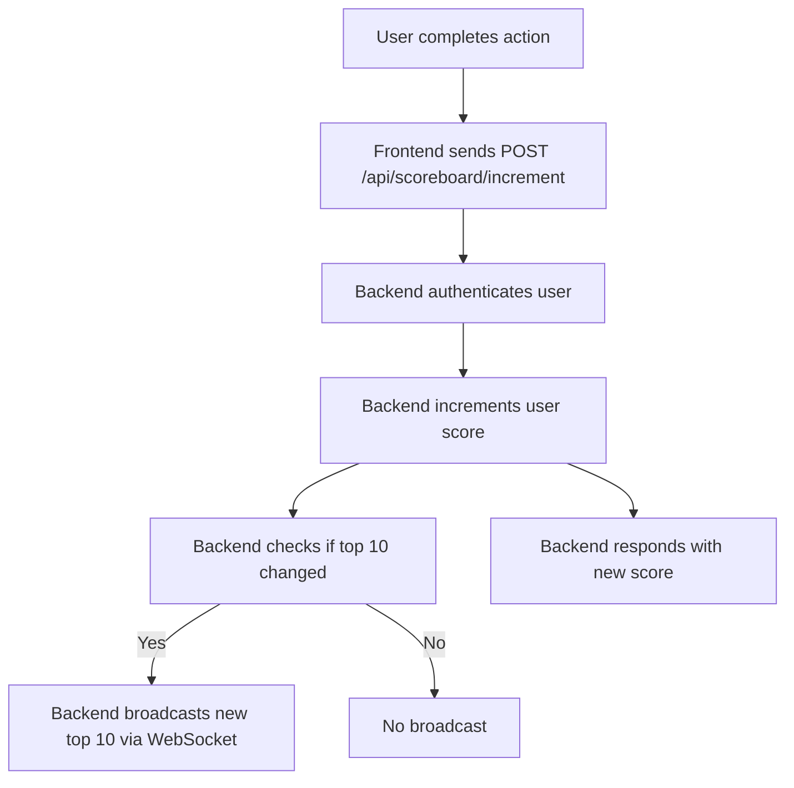

# CRUD Resource API (Express + TypeScript + Prisma)

## 📦 Yêu cầu
- Node.js >= 16
- PostgreSQL (Docker khuyến nghị, xem db.docker-compose.yml)

## 🚀 Cài đặt

```bash
npm install
```

## 🗄️ Khởi tạo database với Docker

```bash
docker compose -f db.docker-compose.yml up -d
```

## 🛠️ Migrate database

```bash
npx prisma migrate dev --name init
```

## ▶️ Chạy server

```bash
npm run dev
```

## 📚 API Endpoints

- `POST   /api/resources`         : Tạo resource mới
- `GET    /api/resources`         : Lấy tất cả resource
- `GET    /api/resources/:id`     : Lấy resource theo id
- `PUT    /api/resources/:id`     : Cập nhật resource
- `DELETE /api/resources/:id`     : Xóa resource
- `POST   /api/resources/postmain`: Nạp nhiều resource từ body (bulk import)

## 🧩 Sử dụng Postman để kiểm thử và nạp dữ liệu hàng loạt

1. Mở Postman và import file `documents/resource.postman.exmaple.json` vào Postman (File > Import > chọn file này).
2. Trong collection sẽ có sẵn các request mẫu cho CRUD và bulk import.
3. Để nạp nhiều resource:
   - Chọn request `POST /api/resources/postmain` trong collection.
   - Vào tab `Body`, chọn `raw` và `JSON`.
   - Dán hoặc chỉnh sửa mảng JSON, ví dụ:
     ```json
     [
       { "name": "Resource Docker 1", "type": "docker-type1" },
       { "name": "Resource Docker 2", "type": "docker-type2" }
     ]
     ```
   - Nhấn `Send` để nạp dữ liệu.

## 🧪 Test

```bash
npm test
```

Các test sẽ kiểm tra toàn bộ route, bao gồm cả nạp nhiều resource từ body hoặc file.

# Live Scoreboard API Module Specification

## Overview
This module provides a backend API service for a website scoreboard. It manages user scores, supports live updates for the top 10 users, and ensures secure score updates.

---

## Features
1. **Top 10 Scoreboard API**: Returns the top 10 users by score.
2. **Live Update**: Supports real-time updates to all connected clients when the scoreboard changes.
3. **Score Update API**: Allows a user to increment their score upon completing an action.
4. **Security**: Prevents unauthorised score increases.

---

## API Endpoints

### 1. `GET /api/scoreboard/top10`
- **Description**: Get the top 10 users by score.
- **Response**:
  ```json
  [
    { "userId": "string", "username": "string", "score": 123 },
    ...
  ]
  ```

### 2. `POST /api/scoreboard/increment`
- **Description**: Increment the score for the authenticated user.
- **Request Body**: _Empty or optional action context._
- **Authentication**: Requires a valid session or JWT token.
- **Response**:
  ```json
  { "success": true, "score": 124 }
  ```

### 3. `WebSocket /ws/scoreboard`
- **Description**: Clients connect to receive live scoreboard updates.
- **Message**: Whenever the top 10 changes, broadcast the new list.

---

## Execution Flow Diagram



---

## Security Considerations
- **Authentication**: All score updates require a valid user session or JWT.
- **Rate Limiting**: Prevent rapid score increases (e.g., max N per minute).
- **Audit Logging**: Log all score changes for review.
- **Input Validation**: Ensure only allowed actions can trigger score updates.

---

## Suggestions for Improvement
- Add admin endpoints for score resets or moderation.
- Add user profile endpoints for richer scoreboard context.
- Consider using Redis or in-memory cache for fast top 10 queries and pub/sub for live updates.
- Add tests for security and race conditions.

---

## Implementation Notes
- Use WebSocket (e.g., Socket.IO) for live updates.
- Use JWT or session-based authentication.
- Use a relational DB (e.g., PostgreSQL) for persistent scores.
- Use Prisma or similar ORM for DB access.
